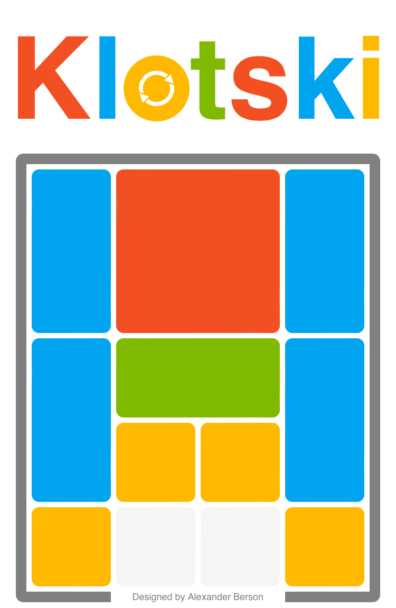

# Klotski

Free the red square block.   
You can [play Klotski online](https://alex-berson.github.io/klotski/) or  

**SPOILER ALERT!** You can also [watch an AI solving Klotski in the fewest possible moves](https://alex-berson.github.io/klotski/?mode=ai).

## Description

**Klotski¹**, also known as **Huarong Dao²**, **Hakoiri Musume³**, and **L’Âne Rouge⁴**, is a sliding block puzzle game featuring a 4x5 board with 10 blocks of various sizes and 2 empty spaces. Each block can only be moved horizontally or vertically. The objective of the game is to move the largest block out of the board.

**Klotski1**, also known as **Huarong Dao2**, **Hakoiri Musume3**, and **L’Âne Rouge4**, is a sliding block puzzle game featuring a 4x5 board with 10 blocks of various sizes and 2 empty spaces. Each block can only be moved horizontally or vertically. The objective of the game is to move the largest block out of the board.

1. From Polish: *klocki*, lit. "blocks"  
2. Chinese: 华容道 or 華容道, lit. "Huarong Trail"  
3. Japanese: 箱入り娘, lit. "Daughter in the Box"  
4. French: *L’Âne Rouge*, lit. "Red Donkey"
  

## Screenshot

  

## License

Copyright &copy; 2024 Alexander Berson. This project is licensed under the [MIT license](LICENSE.txt "MIT License").

